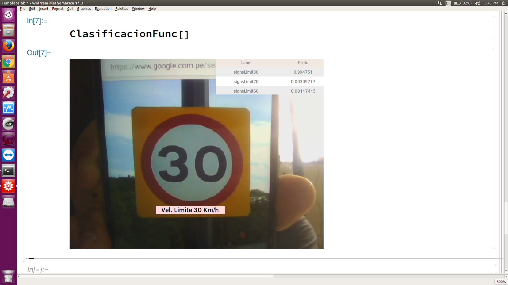

# TrafficSignClassificationRealTime_Mathematica
Project of Summer School of Wolfram in Mathematica. 

This application was created in Mathematica 11.3

It was trained with 16 classes of German Traffic Sign Dataset (GTSDB) 

Dataset of 16 classes: https://drive.google.com/open?id=1e3dm79sqC9ClZCphclmlefxtaVB5-9pZ

If you want full dataset: http://benchmark.ini.rub.de/?section=gtsdb&subsection=dataset

## Some Predictions.

In this case Mathematica helps you to build your CNN and take picture with very short code. It is one of its advantages.

Another example where it can differentiate from other speed limit signs accurately.

Main file: "ProjectSummerSchool"

Notebook to run: "ProjectSummerSchool/Template.nb"

Weights of CNN: "ProjectSummerSchool/net.m"

Notebook of experimentations: "Project.nb"

