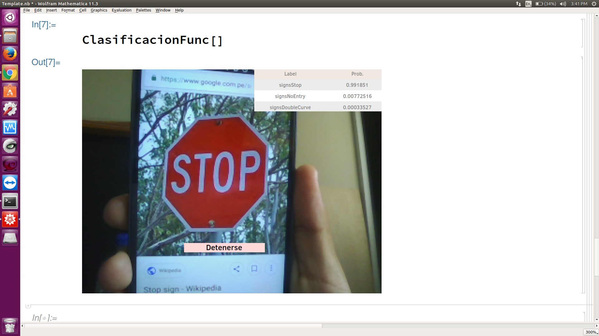

# TrafficSignClassificationRealTime_Mathematica
Project of Summer School of Wolfram in Mathematica. 

This application was created in Mathematica 11.3

It was trained with 19 classes of German Traffic Sign Dataset (GTSDB) 

In this case Mathematica helps you to build your CNN and take picture with very short code. It is one of its advantages.
